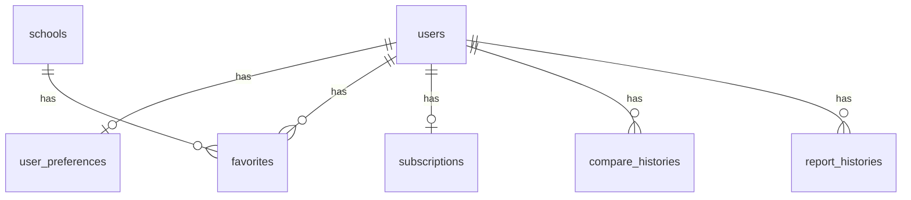

# DB 設計書：ENKATSU 〜園活を円滑に〜

> 本 DB 設計書は、画面設計書 v0.7 を最新版として優先し、MVP 実装に必要なデータ構造を整理する。
>
> ER 図は drawSQL で作成し、リポジトリ内（例：`docs/diagrams/erd.jpg`）で管理することを推奨。
>
> * drawSQL: https://drawsql.app/
> * VSCode Extension: Draw.io Integration

---

## 1. 設計方針

* 採用 DBMS：Supabase Postgres（PostgreSQL）
* ORM：Prisma
* 認証：Supabase Auth
* 決済：Stripe Checkout / Stripe Customer Portal
* キャッシュ：Redis
* 命名規則

  * テーブル名：複数形
  * カラム名：snake_case
  * 主キー：id
  * 外部キー：`xxx_id`
* 画面設計書 v0.7 を最新版として優先する
* 園情報は MVP では seed データで管理する
* 管理画面 CRUD は MVP 対象外
* お気に入りは一般ユーザーも利用可能とし、一般ユーザーは最大5件、プレミアムユーザーは無制限とする
* 比較は一般ユーザーは2園、プレミアムユーザーは3園までとする
* プロフィール編集画面で登録するお名前・郵便番号・住所は、`users` テーブルで管理する
* プロフィール編集画面で登録するユーザー希望条件は、`user_preferences` テーブルで管理する
* ユーザー希望条件は、園一覧検索条件と揃えて8項目で扱う
* ユーザー希望条件は、ホーム画面のおすすめ表示とプレミアム比較画面の一致表示に利用する
* プレミアム判定は `subscriptions.status = ACTIVE` を正とし、`users.plan_type` は画面表示用の補助情報として扱う
* 会員登録後は一般ユーザーとして扱う
* アプリ側の `users` レコードは、`GET /users/me` 実行時に必要に応じて自動作成する
* `compare_histories` は将来拡張用として存在するが、MVPでは比較履歴保存は行わない
* `report_histories` は将来拡張用として存在する
* RedisキャッシュはMVPで利用する
* 物理削除 / 論理削除

  * MVP では基本的に物理削除とする
  * 園情報は seed データのため削除機能は MVP 対象外
* マイグレーション運用方針

  * Prisma Migrate を利用する
  * スキーマ変更時は migration ファイルを作成し、チームで共有する

---

## 2. ER 図


### ER図 更新内容

ユーザー希望条件対応により、以下のリレーションを追加する。

```txt
users 1 ─── 0..1 user_preferences
```

意味：

* 1人のユーザーは、希望条件を0件または1件持つ
* 1件の希望条件は、必ず1人のユーザーに紐づく
* `user_preferences.user_id` に UNIQUE 制約を設定し、1ユーザーにつき希望条件は1件のみ保持する

Mermaidで表す場合：



---

## 3. テーブル一覧

| テーブル名 | 役割 |
| --- | --- |
| users | Supabase Auth と紐づくアプリ内ユーザー情報・プロフィール情報・会員状態を管理する |
| user_preferences | ユーザーごとの希望条件を管理する |
| schools | 園の基本情報・生活負担・時間負担・サポート情報を管理する |
| favorites | ユーザーがお気に入り登録した園を管理する |
| subscriptions | Stripe の課金状態・プレミアム状態を管理する |
| compare_histories | 将来拡張用。比較履歴を管理する |
| report_histories | 将来拡張用。レポート履歴を管理する |

---

## 4. テーブル定義

### 4.1 users

Supabase Auth のユーザー情報、アプリ内で利用するプロフィール情報、会員状態を管理する。

ENKATSUにおける会員登録は、無料のユーザー登録を指す。
会員登録後は一般ユーザーとして扱い、`plan_type` の初期値は `FREE` とする。

MVPでは、Supabase Auth 上のユーザーは存在するがアプリ側 `users` レコードが存在しない場合、`GET /api/v1/users/me` 実行時にバックエンド側で `users` レコードを自動作成する。

プロフィール編集画面で入力するお名前・郵便番号・住所は、`PUT /api/v1/users/me` で保存・更新する。
郵便番号はハイフンなし7桁で保存する。

| カラム名 | 型 | NULL | デフォルト | 説明 |
| --- | --- | --- | --- | --- |
| id | uuid | NO | uuid() | アプリ内ユーザーID |
| supabase_user_id | uuid | YES | - | Supabase Auth User ID |
| email | varchar(255) | NO | - | メールアドレス |
| name | varchar(100) | YES | - | ユーザーの表示名・お名前 |
| postal_code | varchar(7) | YES | - | ユーザー住所の郵便番号。ハイフンなし7桁 |
| address | varchar(255) | YES | - | ユーザー住所 |
| plan_type | membership_type | NO | FREE | 表示用の会員種別（FREE / PAID） |
| created_at | timestamp | NO | now() | 作成日時 |
| updated_at | timestamp | NO | now() | 更新日時 |

#### users レコード自動作成時の初期値

| カラム名 | 初期値 |
| --- | --- |
| id | UUIDを自動生成 |
| supabase_user_id | Supabase Auth User ID |
| email | Supabase Auth のメールアドレス |
| name | null |
| postal_code | null |
| address | null |
| plan_type | FREE |
| created_at | 作成日時 |
| updated_at | 作成日時 |

#### users のリレーション

| 関連テーブル | 関係 | 説明 |
| --- | --- | --- |
| user_preferences | 1 : 0..1 | ユーザーごとの希望条件を保持する |
| favorites | 1 : 多 | ユーザーのお気に入り園を保持する |
| subscriptions | 1 : 0..1 | ユーザーの課金状態を保持する |
| compare_histories | 1 : 多 | 将来拡張用の比較履歴を保持する |
| report_histories | 1 : 多 | 将来拡張用のレポート履歴を保持する |

---

### 4.2 user_preferences

ユーザーごとの希望条件を保存するテーブル。

プロフィール編集画面で保存された希望条件を保持し、比較APIの `matchHighlights` 判定や、おすすめ順ロジックで利用する。

希望条件は、園一覧検索条件と揃えて以下の8項目で扱う。

| 画面表示 | 検索APIでの対応 | 希望条件API項目 | 保存する値の例 |
| --- | --- | --- | --- |
| 毎日給食 | mealType=SCHOOL_LUNCH | preferredMealType | SCHOOL_LUNCH |
| おむつ園処理あり | diaperSupport=true | preferredDiaperSupport | 園で廃棄 |
| 布団負担少なめ | futonSupport=true | preferredFutonSupport | 園で管理 |
| 保護者会少なめ | parentAssociationLevel=LOW | preferredParentAssociationLevel | LOW |
| 延長保育利用者が多い | extendedCareUsage=true | preferredExtendedCare | 20人以上 |
| 園内習い事あり | lessons=true | preferredLessons | true |
| アレルギー対応あり | allergySupport=true | preferredAllergySupport | true |
| 平日行事少なめ | weekdayEventsLevel=LOW | preferredWeekdayEventsLevel | LOW |

| カラム名 | 型 | NULL | デフォルト | 説明 |
| --- | --- | --- | --- | --- |
| id | uuid | NO | uuid() | 希望条件ID |
| user_id | uuid | NO | - | users.id を参照 |
| preferred_meal_type | meal_type | YES | - | 希望する給食・弁当区分 |
| preferred_item_burden_level | burden_level | YES | - | 希望する持ち物負担レベル |
| preferred_diaper_support | varchar(50) | YES | - | 希望するおむつ対応 |
| preferred_futon_support | varchar(50) | YES | - | 希望する布団対応 |
| preferred_extended_care | varchar(50) | YES | - | 希望する延長保育条件 |
| preferred_lessons | boolean | YES | - | 園内習い事ありを希望するか |
| preferred_allergy_support | boolean | YES | - | アレルギー対応ありを希望するか |
| preferred_weekday_events_level | burden_level | YES | - | 希望する平日行事負担レベル |
| preferred_parent_association_level | burden_level | YES | - | 希望する保護者会負担レベル |
| created_at | timestamp | NO | now() | 作成日時 |
| updated_at | timestamp | NO | now() | 更新日時 |

#### user_preferences のリレーション

| 元テーブル | 関連テーブル | 関係 | 説明 |
| --- | --- | --- | --- |
| user_preferences | users | 多 : 1 | 希望条件は必ず1人のユーザーに紐づく |

#### 備考

* `user_id` は UNIQUE 制約を持つため、1ユーザーにつき希望条件は1件のみ保存する
* 希望条件が未設定の場合、APIでは `preference: null` を返す
* 希望条件は `PATCH /api/v1/users/me/preferences` で保存・更新する
* `upsert` を利用し、未作成の場合は作成、作成済みの場合は更新する
* 比較APIの `matchHighlights` およびおすすめ順ロジックで参照する
* `preferred_lessons` と `preferred_allergy_support` は、園一覧検索条件の `lessons=true` / `allergySupport=true` と対応する
* `preferred_item_burden_level` は現在のPrisma schemaに存在するが、現時点の園一覧検索条件8項目には含めない方針とする

---

### 4.3 schools

園（保育園・こども園等）の基本情報・生活負担・時間負担・サポート情報を管理する。

MVP では seed データとして登録し、管理画面からの CRUD は対象外とする。

| カラム名 | 型 | NULL | デフォルト | 説明 |
| --- | --- | --- | --- | --- |
| id | bigint | NO | autoincrement | 主キー |
| name | varchar(255) | NO | - | 園名 |
| area | varchar(100) | NO | - | エリア・市区町村 |
| address | varchar(255) | NO | - | 住所 |
| phone_number | varchar(20) | YES | - | 電話番号 |
| image_url | varchar(255) | YES | - | 園画像URL |
| school_type | school_type | NO | - | 園種別 |
| life_burden_level | burden_level | NO | - | 生活負担 |
| time_burden_level | burden_level | NO | - | 時間負担 |
| meal_type | meal_type | NO | - | 給食・弁当 |
| item_burden_level | burden_level | NO | - | 持ち物負担 |
| item_burden_detail | varchar(255) | YES | - | 持ち物負担の補足説明 |
| diaper_support | varchar(50) | YES | - | おむつ対応 |
| futon_support | varchar(50) | YES | - | 布団対応 |
| extended_care_hours | varchar(50) | YES | - | 延長保育利用時間 |
| extended_care_usage | varchar(50) | NO | - | 延長保育利用者の目安・多さ |
| weekday_events_level | burden_level | NO | - | 平日行事の多さ |
| weekday_events | varchar(100) | YES | - | 平日行事の補足説明 |
| parent_association_level | burden_level | NO | - | 保護者会の負担 |
| parent_association_frequency | varchar(100) | YES | - | 保護者会頻度 |
| contact_book_type | contact_type | YES | - | 連絡帳 |
| absence_contact_method | contact_type | YES | - | 欠席連絡方法 |
| lessons | varchar(255) | YES | - | 園内習い事 |
| allergy_support | varchar(255) | YES | - | アレルギー対応 |
| description | text | YES | - | 園の特徴・補足説明 |
| created_at | timestamp | NO | now() | 作成日時 |
| updated_at | timestamp | NO | now() | 更新日時 |

---

### 4.4 favorites

ユーザーがお気に入り登録した園を管理する。

一般ユーザーは5件まで、プレミアムユーザーは無制限で登録できる。
お気に入り登録上限は DB 制約ではなく、API 側で制御する。

| カラム名 | 型 | NULL | デフォルト | 説明 |
| --- | --- | --- | --- | --- |
| id | bigint | NO | autoincrement | 主キー |
| user_id | uuid | NO | - | users.id を参照 |
| school_id | bigint | NO | - | schools.id を参照 |
| created_at | timestamp | NO | now() | 作成日時 |

---

### 4.5 subscriptions

ユーザーのプレミアム課金状態を管理する。

プレミアム判定は `subscriptions.status = ACTIVE` を正とする。
`users.plan_type` は画面表示や簡易的な会員種別表示のための補助情報として扱う。

| カラム名 | 型 | NULL | デフォルト | 説明 |
| --- | --- | --- | --- | --- |
| id | bigint | NO | autoincrement | 主キー |
| user_id | uuid | NO | - | users.id を参照 |
| stripe_customer_id | varchar(255) | YES | - | Stripe 顧客ID |
| stripe_subscription_id | varchar(255) | YES | - | Stripe Subscription ID |
| current_period_end | timestamp | YES | - | 現在の契約期間終了日時 |
| status | subscription_status | NO | ACTIVE | ACTIVE / CANCELED / EXPIRED |
| started_at | timestamp | NO | now() | 開始日時 |
| ended_at | timestamp | YES | - | 終了日時 |
| created_at | timestamp | NO | now() | 作成日時 |
| updated_at | timestamp | NO | now() | 更新日時 |

---

### 4.6 compare_histories

ユーザーの比較履歴を管理するためのテーブル。

MVPでは比較履歴保存は行わないが、将来拡張用としてテーブルを保持する。

| カラム名 | 型 | NULL | デフォルト | 説明 |
| --- | --- | --- | --- | --- |
| id | bigint | NO | autoincrement | 主キー |
| user_id | uuid | NO | - | users.id を参照 |
| school_ids | bigint[] | NO | - | 比較対象の園ID配列 |
| created_at | timestamp | NO | now() | 作成日時 |

---

### 4.7 report_histories

ユーザーのレポート履歴を管理するためのテーブル。

MVPではAIレポート生成結果の保存は行わないが、将来拡張用としてテーブルを保持する。

| カラム名 | 型 | NULL | デフォルト | 説明 |
| --- | --- | --- | --- | --- |
| id | bigint | NO | autoincrement | 主キー |
| user_id | uuid | NO | - | users.id を参照 |
| school_id | bigint | YES | - | schools.id |
| title | varchar(255) | YES | - | レポートタイトル |
| created_at | timestamp | NO | now() | 作成日時 |

---

## 5. インデックス・制約

### 5.1 users

* 主キー：`id`
* `supabase_user_id` にユニーク制約を設定する
* `email` にユニーク制約を設定する
* `name`、`postal_code`、`address` にはユニーク制約・インデックスは設定しない

```sql
UNIQUE(supabase_user_id)
UNIQUE(email)
```

---

### 5.2 user_preferences

* 主キー：`id`
* `user_id` は `users.id` を参照する
* `user_id` にユニーク制約を設定する
* `users` が削除された場合、紐づく `user_preferences` も削除する

```sql
UNIQUE(user_id)
FOREIGN KEY(user_id) REFERENCES users(id) ON DELETE CASCADE
```

---

### 5.3 schools

* 主キー：`id`
* 検索で利用する `area` にインデックスを設定する
* 検索・絞り込みで利用する `school_type`、`life_burden_level`、`time_burden_level`、`meal_type` にインデックスを設定する

```sql
INDEX(area)
INDEX(school_type)
INDEX(life_burden_level)
INDEX(time_burden_level)
INDEX(meal_type)
```

---

### 5.4 favorites

* 主キー：`id`
* `user_id` は `users.id` を参照する
* `school_id` は `schools.id` を参照する
* 同じユーザーが同じ園を重複してお気に入り登録できないように複合ユニーク制約を設定する
* `users` または `schools` が削除された場合、紐づく `favorites` も削除する

```sql
UNIQUE(user_id, school_id)
INDEX(user_id)
INDEX(school_id)
FOREIGN KEY(user_id) REFERENCES users(id) ON DELETE CASCADE
FOREIGN KEY(school_id) REFERENCES schools(id) ON DELETE CASCADE
```

お気に入り登録件数は DB 制約ではなく API 側で制御する。

* 未登録ユーザー：利用不可
* 一般ユーザー：最大5件
* プレミアムユーザー：無制限

---

### 5.5 subscriptions

* 主キー：`id`
* `user_id` は `users.id` を参照する
* `user_id` にユニーク制約を設定する
* `stripe_subscription_id` にユニーク制約を設定する
* `users` が削除された場合、紐づく `subscriptions` も削除する

```sql
UNIQUE(user_id)
UNIQUE(stripe_subscription_id)
FOREIGN KEY(user_id) REFERENCES users(id) ON DELETE CASCADE
```

---

### 5.6 compare_histories

* 主キー：`id`
* `user_id` は `users.id` を参照する
* `user_id` にインデックスを設定する
* `users` が削除された場合、紐づく `compare_histories` も削除する

```sql
INDEX(user_id)
FOREIGN KEY(user_id) REFERENCES users(id) ON DELETE CASCADE
```

MVPでは比較履歴保存は行わない。
比較対象の最大件数制御は、比較取得API側で行う。

* 一般ユーザー：最大2園
* プレミアムユーザー：最大3園

---

### 5.7 report_histories

* 主キー：`id`
* `user_id` は `users.id` を参照する
* `user_id` にインデックスを設定する
* `school_id` にインデックスを設定する
* `users` が削除された場合、紐づく `report_histories` も削除する

```sql
INDEX(user_id)
INDEX(school_id)
FOREIGN KEY(user_id) REFERENCES users(id) ON DELETE CASCADE
```

---

## 6. データ保持・整合性ルール

* 園情報は MVP では seed データとして登録する
* お気に入りはユーザーごとに DB 保存する
* ユーザーのプロフィール情報は `users` に保存する
* プロフィール情報として、お名前・郵便番号・住所を保持する
* 郵便番号はハイフンなし7桁で保存する
* 郵便番号から住所を取得する処理は `GET /api/v1/address/search?zipcode=1234567` で行う
* 住所検索APIは住所自動入力用であり、DB保存は行わない
* お名前・郵便番号・住所の保存は `PUT /api/v1/users/me` で行う
* ユーザー希望条件は `user_preferences` に保存する
* ユーザー希望条件は、園一覧検索条件と揃えて8項目で扱う
* 1ユーザーにつき希望条件は0件または1件とする
* 希望条件が未設定の場合、APIでは `preference: null` を返す
* MVP では比較履歴は DB 保存しない
* `/mypage/favorites` 画面で選択した school_id を `/compare` に渡し、比較情報を取得する
* お気に入りの重複登録は DB 側の複合ユニーク制約で防止する
* お気に入り登録上限は API 側で制御する
* 比較数の上限は比較取得API側で制御する
* 未ログインユーザーは `favorites`、`users` 更新系 API、`user_preferences` 更新系 API を利用できない
* 一般ユーザーがプレミアム限定情報を取得しようとした場合は、バックエンド側でも認可チェックを行う
* ユーザー退会機能は MVP 対象外とする
* 会員登録後、Supabase Auth 上のユーザーは存在するが `users` レコードが存在しない場合は、`GET /api/v1/users/me` 実行時に一般ユーザーとして自動作成する

---

## 7. プレミアム判定方針

* プレミアム会員の判定は `subscriptions.status = ACTIVE` を正とする
* `users.plan_type` は画面表示や簡易的な会員種別判定のための補助情報として保持する
* プレミアム機能の利用可否は `subscriptions.status = ACTIVE` をもとに判定する
* Stripe の決済状態が変更された場合は、Webhook で `subscriptions.status` を更新する
* 必要に応じて `users.plan_type` と同期する

---

## 8. Redisキャッシュ方針

MVPでは、園一覧・検索結果・おすすめ表示でRedisキャッシュを利用する。

RedisはDBテーブルではないが、園データ取得時のパフォーマンス改善のために利用する。

### 8.1 キャッシュ対象

| 対象 | 内容 |
| --- | --- |
| 園一覧 | 全件またはページング済みの園一覧 |
| 検索結果 | キーワード・条件検索の結果 |
| おすすめ表示 | ユーザー住所・希望条件をもとにしたおすすめ表示の元データ |

### 8.2 キャッシュ対象外

以下のようなログインユーザーごとに変わる情報は、キャッシュ対象から分けて扱う。

| 対象外 | 理由 |
| --- | --- |
| `isFavorited` | ユーザーごとに異なるため |
| `favoriteCount` | ユーザーごとに異なるため |
| `favoriteLimit` | ユーザー区分ごとに異なるため |
| `isPremium` | 課金状態により変わるため |
| `preference` | ユーザーごとに異なるため |
| `matchHighlights` | ユーザー希望条件により変わるため |
| サポート情報の閲覧可否 | 会員区分により変わるため |

### 8.3 キャッシュキー方針

検索条件・並び順・ページング条件をもとにキャッシュキーを作成する。

例：

```txt
schools:list:keyword=sakura:mealType=school_lunch:sort=createdAtDesc:limit=20:offset=0
schools:recommended:area=渋谷区:preferences=mealType_school_lunch_item_low
```

### 8.4 キャッシュ削除方針

MVPでは園情報は seed データで管理するため、頻繁な更新は想定しない。

キャッシュ削除は以下の場合に行う。

* seed データを更新した場合
* 園データの内容を変更した場合
* 開発中にキャッシュの不整合が発生した場合
* ユーザー希望条件を更新し、おすすめ表示に不整合が発生する場合

TTLはMVPでは任意とする。
設定する場合は、短時間のTTLから開始する。

---

## 9. Enum 定義

Prisma では以下の enum を定義する。

```prisma
enum BurdenLevel {
  LOW
  MEDIUM
  HIGH
}

enum SchoolType {
  NURSERY
  KINDERGARTEN
  CERTIFIED_CHILDCARE_CENTER
}

enum MealType {
  SCHOOL_LUNCH
  LUNCH_BOX
  BOTH
}

enum ContactType {
  APP
  PHONE
  PAPER
  OTHER
}

enum MembershipType {
  FREE
  PAID
}

enum SubscriptionStatus {
  ACTIVE
  CANCELED
  EXPIRED
}
```

---

## 10. MVP で持たないデータ

以下は MVP では DB 管理しない。

* 口コミ投稿
* 口コミ承認
* 人気ランキング
* AI レポート生成結果
* 地図情報
* 通知履歴
* PDF 出力履歴
* 請求履歴一覧
* 管理画面 CRUD 用の監査ログ
* 実在園データの大量登録
* 比較リスト保存
* 比較履歴保存
* 比較チャート保存

---

## 11. seed データ方針

MVP では `schools` に園データを seed で登録する。

seed データには、画面表示・検索・比較に必要な以下の情報を含める。

* 園名
* エリア
* 住所
* 電話番号
* 園種別
* 園画像URL
* 生活負担
* 時間負担
* 給食・弁当
* 持ち物負担
* 持ち物負担詳細
* おむつ対応
* 布団対応
* 延長保育利用時間
* 延長保育利用者の目安
* 平日行事
* 平日行事詳細
* 保護者会
* 保護者会頻度
* 連絡帳
* 欠席連絡方法
* 園内習い事
* アレルギー対応
* 園の特徴・補足説明

---

## 12. Prisma schema 作成時の補足

### 12.1 users

* `id` はアプリ内ユーザーIDとして UUID を使用する
* `supabase_user_id` は Supabase Auth User ID と紐づける
* `supabase_user_id` はユニークにする
* `email` はユニークにする
* `name` はユーザーの表示名・お名前として保持する
* `postal_code` はユーザー住所の郵便番号として保持する
* `postal_code` はハイフンなし7桁で保存する
* `address` はユーザー住所として保持する
* `name` / `postal_code` / `address` は nullable とし、未登録時は null とする
* プロフィール情報の保存・更新は `PUT /api/v1/users/me` で行う
* `plan_type` の初期値は `FREE` とする
* ユーザー希望条件は `users` ではなく `user_preferences` に分離する

### 12.2 user_preferences

* `user_id` は `users.id` を参照する
* `user_id` にユニーク制約を設定し、1ユーザーにつき1件のみ保持する
* `users` 削除時は、紐づく `user_preferences` も削除する
* 希望条件未設定時はレコードなしとし、APIでは `preference: null` を返す
* 保存・更新は `PATCH /api/v1/users/me/preferences` で行う
* 後続の比較API・おすすめ順ロジックで参照する
* `preferred_lessons` は、園内習い事ありを希望するかを boolean で保持する
* `preferred_allergy_support` は、アレルギー対応ありを希望するかを boolean で保持する

### 12.3 schools

* 園情報は seed データで管理する
* 検索対象となる `area`、`school_type`、`life_burden_level`、`time_burden_level`、`meal_type` にはインデックスを設定する
* 管理画面からのCRUDはMVP対象外とする

### 12.4 favorites

* `user_id` と `school_id` に複合ユニーク制約を設定する
* お気に入り登録上限はDB制約ではなくAPI側で制御する

### 12.5 subscriptions

* プレミアム判定は `status = ACTIVE` を正とする
* `user_id` と `stripe_subscription_id` はユニークにする
* Stripe Webhookで `status` と `current_period_end` を更新する
* 必要に応じて `users.plan_type` も同期する

### 12.6 compare_histories

* MVPでは比較履歴保存は行わない
* 将来拡張用としてテーブルを保持する

### 12.7 report_histories

* MVPではAIレポート生成結果の保存は行わない
* 将来拡張用としてテーブルを保持する

### 12.8 Redis

* RedisはPrisma schemaには定義しない
* Docker Compose で Redis サービスを追加する
* 園一覧・検索結果・おすすめ表示のキャッシュに利用する
* ユーザー固有情報はキャッシュ対象と分けて扱う

---

## 13. 変更履歴

| バージョン | 日付 | 変更内容 |
| --- | --- | --- |
| v0.1 | 2026/06/22 | 画面設計書 v0.5 を最新版として優先し、一般ユーザーのお気に入り上限・プロフィール希望条件・Stripe 解約フローに合わせて修正 |
| v0.2 | 2026/06/23 | 画面設計書 v0.7 を最新版として優先する記載に修正。`GET /users/me` 実行時の `users` レコード自動作成方針を追加。`compare_lists` はMVPではAPIから利用しないが将来拡張用としてテーブルのみ作成する方針に統一。RedisキャッシュをMVP必須として追加。DB上は `postal_code`、`address` をNULL許可とし、プロフィール編集画面では必須入力とする方針を明記 |
| v0.3 | 2026/06/24 | ユーザー希望条件を `users` から分離し、`user_preferences` テーブルとして追加。`users` と `user_preferences` の 1対0..1 リレーションを追加。現在のPrisma schemaに合わせて `compare_histories`、`report_histories`、Enum定義、学校情報カラムを整理 |
| v0.4 | 2026/06/25 | ユーザー希望条件を園一覧検索条件と揃えて8項目で扱う方針に修正。`user_preferences` に `preferred_lessons` / `preferred_allergy_support` を追加 |
| v0.5 | 2026/06/25 | マイページのプロフィール情報保存API追加に伴い、`users` に `name` / `postal_code` / `address` を追加。プロフィール情報は `PUT /api/v1/users/me` で保存し、郵便番号はハイフンなし7桁で保持する方針を追加 |