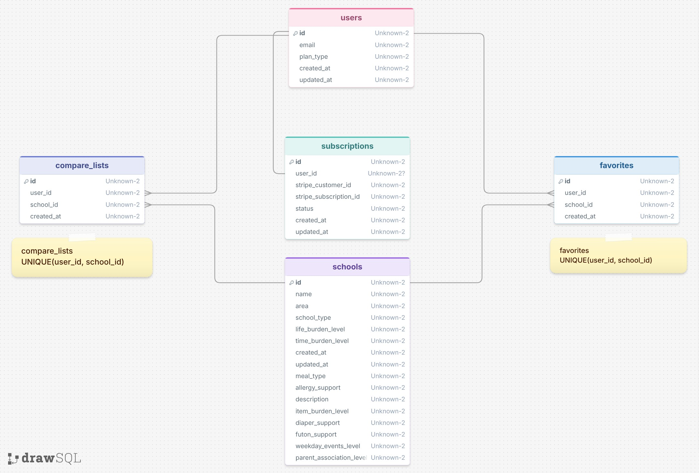

# DB 設計

> ER 図は drawSQL で作成し、リポジトリ内（例：`docs/diagrams/erd.png`）で管理することを推奨。
>
> - drawSQL: https://drawsql.app/
> - VSCode Extension: Draw.io Integration

## 1. 設計方針

- 採用 DBMS：PostgreSQL
- ORM：Prisma
- 認証：Supabase Auth
- 決済：Stripe
- 命名規則
  - テーブル名：複数形
  - カラム名：snake_case
  - 主キー：id
  - 外部キー：`xxx_id`

- プレミアムプラン：月額課金
- 比較リスト・お気に入りは DB に保存する
- 物理削除 / 論理削除
  - MVP では基本的に物理削除とする
  - 園情報は seed データで管理するため削除機能は MVP 対象外

- マイグレーション運用方針
  - Prisma Migrate を利用する
  - スキーマ変更時は migration ファイルを作成しチームで共有する

---

## 2. ER 図



---

## 3. テーブル定義

### users

Supabase Auth のユーザー情報とアプリ内の会員状態を管理する。

| カラム名   | 型           | NULL | デフォルト | 説明                            |
| ---------- | ------------ | ---- | ---------- | ------------------------------- |
| id         | uuid         | NO   | -          | 主キー（Supabase Auth User ID） |
| email      | varchar(255) | NO   | -          | メールアドレス                  |
| plan_type  | varchar(20)  | NO   | free       | 会員種別（free / premium）      |
| created_at | timestamp    | NO   | now()      | 作成日時                        |
| updated_at | timestamp    | NO   | now()      | 更新日時                        |

---

### schools

園（保育園・こども園等）の基本情報・生活負担・時間負担・補助情報を管理する。

MVPでは seed データとして登録し、管理画面からのCRUDは対象外とする。

| カラム名                 | 型           | NULL | デフォルト | 説明                 |
| ------------------------ | ------------ | ---- | ---------- | -------------------- |
| id                       | bigint       | NO   | -          | 主キー               |
| name                     | varchar(255) | NO   | -          | 園名                 |
| area                     | varchar(100) | NO   | -          | エリア               |
| address                  | varchar(255) | NO   | -          | 住所                 |
| school_type              | varchar(50)  | NO   | -          | 園種別               |
| life_burden_level        | varchar(20)  | NO   | -          | 生活負担             |
| time_burden_level        | varchar(20)  | NO   | -          | 時間負担             |
| meal_type                | varchar(50)  | NO   | -          | 給食・弁当           |
| item_burden_level        | varchar(20)  | NO   | -          | 持ち物負担           |
| diaper_support           | varchar(50)  | YES  | -          | おむつ対応           |
| futon_support            | varchar(50)  | YES  | -          | 布団対応             |
| extended_care_usage      | varchar(20)  | NO   | -          | 延長保育利用者の多さ |
| weekday_events_level     | varchar(20)  | NO   | -          | 平日行事の多さ       |
| parent_association_level | varchar(20)  | NO   | -          | 保護者会の負担       |
| contact_book_type        | varchar(50)  | YES  | -          | 連絡帳               |
| absence_contact_method   | varchar(50)  | YES  | -          | 欠席連絡方法         |
| lessons                  | varchar(255) | YES  | -          | 園内習い事           |
| allergy_support          | varchar(255) | YES  | -          | アレルギー対応       |
| description              | text         | YES  | -          | 園の説明             |
| created_at               | timestamp    | NO   | now()      | 作成日時             |
| updated_at               | timestamp    | NO   | now()      | 更新日時             |

---

### compare_lists

ユーザーが比較したい園を保存する。

| カラム名   | 型        | NULL | デフォルト | 説明       |
| ---------- | --------- | ---- | ---------- | ---------- |
| id         | bigint    | NO   | -          | 主キー     |
| user_id    | uuid      | NO   | -          | users.id   |
| school_id  | bigint    | NO   | -          | schools.id |
| created_at | timestamp | NO   | now()      | 作成日時   |

---

### favorites

プレミアムユーザーがお気に入り登録した園を保存する。

| カラム名   | 型        | NULL | デフォルト | 説明       |
| ---------- | --------- | ---- | ---------- | ---------- |
| id         | bigint    | NO   | -          | 主キー     |
| user_id    | uuid      | NO   | -          | users.id   |
| school_id  | bigint    | NO   | -          | schools.id |
| created_at | timestamp | NO   | now()      | 作成日時   |

---

### subscriptions

ユーザーのプレミアム課金状態を管理する。

| カラム名               | 型           | NULL | デフォルト | 説明                         |
| ---------------------- | ------------ | ---- | ---------- | ---------------------------- |
| id                     | bigint       | NO   | -          | 主キー                       |
| user_id                | uuid         | NO   | -          | users.id                     |
| stripe_customer_id     | varchar(255) | YES  | -          | Stripe 顧客ID                |
| stripe_subscription_id | varchar(255) | YES  | -          | Stripe Subscription ID       |
| status                 | varchar(50)  | NO   | -          | active / canceled / past_due |
| created_at             | timestamp    | NO   | now()      | 作成日時                     |
| updated_at             | timestamp    | NO   | now()      | 更新日時                     |

---

## 4. インデックス・制約

### users

- 主キー：id
- email にユニーク制約を設定する

```sql
UNIQUE(email)
```

### schools

- 主キー：id
- 検索で利用する area にインデックスを設定する

```sql
INDEX(area)
```

### compare_lists

- 主キー：id
- user_id は users.id を参照する
- school_id は schools.id を参照する
- 同じユーザーが同じ園を重複登録できないように複合ユニーク制約を設定する

```sql
UNIQUE(user_id, school_id)
```

比較リストの最大件数は DB 制約ではなく API 側で制御する。

- 一般ユーザー：最大2園
- プレミアムユーザー：最大3園

### favorites

- 主キー：id
- user_id は users.id を参照する
- school_id は schools.id を参照する
- 同じユーザーが同じ園を重複してお気に入り登録できないように複合ユニーク制約を設定する

```sql
UNIQUE(user_id, school_id)
```

### subscriptions

- 主キー：id
- user_id は users.id を参照する
- stripe_customer_id にユニーク制約を設定する
- stripe_subscription_id にユニーク制約を設定する

```sql
UNIQUE(stripe_customer_id)
UNIQUE(stripe_subscription_id)
```

---

## 5. データ保持・整合性ルール

- 園情報は MVP では seed データとして登録する
- 比較リストはユーザーごとに DB 保存する
- 比較リストは園同士の違いを後から見返すために使用する
- お気に入りは入園候補として気になる園を保存するために使用する
- 比較リストの登録上限は API 側で制御する
- 重複登録は DB 側の複合ユニーク制約で防止する
- ユーザー退会機能は MVP 対象外とする

### プレミアム判定方針

- プレミアム会員の判定は `subscriptions.status` を正とする。
- `users.plan_type` は画面表示や簡易的な会員種別判定のための補助情報として保持する。
- プレミアム機能の利用可否は `subscriptions.status = active` をもとに判定する。
- Stripe の決済状態が変更された場合は、`subscriptions.status` を更新し、必要に応じて `users.plan_type` と同期する。
