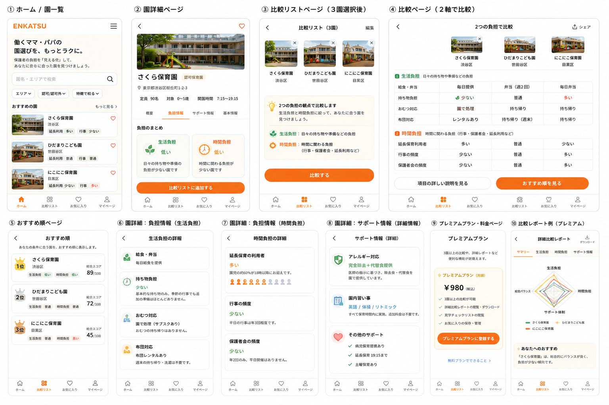

# まずはレビューを受けて…

「のっちさんのアイデアも社会的な意義もあり、素晴らしい課題設定だと思います！
一方で2週間でやり切れるかな？と感じました。この点で、りつさんとうっちーさんの方がやることが明確でかつ機能が最少なのです。
例えばですが、この情報だけを新しく公開する、ぐらいの方が私は良いと思います。**いろんな情報をまとめる、ではなく今まで公開されていなかった「この情報」だけを新しく表示する、の方が課題がクリティカルになって良い**と思います。
「この人」は、「この情報がなくて」、「今、こんな状態になっている」と落とし込むと、本当に取り組むべき優先順位が見えてくると思いました。」

<aside>
💡 そこで、ENKATSUの価値を改めて整理し、単なる保育園比較ではなく、**働く保護者が復職後に困りやすい“保護者負担”を可視化するアプリとして方向性をブラッシュアップ**しました。

ENKATSUを「既存のウェブサイトやアプリからは収集しにくい保育園情報をまとめるて比較するアプリ」ではなく、**働く保護者が復職後に困りやすい“保護者負担”を可視化するアプリ**として再定義しました。

</aside>

これにより、講師レビューで指摘された

> 今まで公開されていなかった“この情報”を新しく表示する
> 

という方向性に近づけられたと考えています。

# 1.  今回のコアコンセプト

ENKATSUは、保育園そのものの良し悪しを比較するアプリではありません。
**仕事復帰を控えた保護者が、自分たちの生活に合った園を選ぶために、“復職後の負担”を比較できるサービス**です。

一言でいうと、「この園に入れた後、仕事と育児が無理なく回るかどうかを判断できるアプリ」です。

# 2.  比較の主軸

比較軸を広げすぎず、以下の2つを主軸にします。

## 生活負担

日々の準備や家事に関わる負担です。

例：

- 給食・弁当
- 持ち物負担
- おむつ対応
- 布団対応

## 時間負担

仕事を抜ける必要や、お迎え時間に関わる負担です。

例：

- 延長保育利用者の多さ
- 平日行事の頻度
- 保護者会の頻度

特に「延長保育」は、単に有無を見るのではなく、**実際に延長保育を利用している家庭が多いかどうか**を重視します。

# 3. 補助情報として扱う項目

以下の情報は、メインの比較軸ではなく、園詳細ページやレポート内で確認できる補助情報として扱います。

例：

- 連絡帳の形式
- 欠席連絡方法
- 園内習い事
- アレルギー対応

これにより、ENKATSUの軸を「保護者負担」に絞りつつ、こだわり条件を持つユーザーにも対応できる形にします。

# 4. 想定ユーザー

メインターゲットは、仕事復帰を控えた共働き家庭です。

特に、以下のようなユーザーに価値が届きやすいと考えています。

- 復職後も仕事をセーブせずに続けたい
- 平日のタスクをできるだけ減らしたい
- 見学前に候補園を効率よく絞り込みたい
- 園に入った後の生活負担を事前に把握したい

# 5. 既存サービスとの差別化

既存サービスは、主に「園の基本情報」を比較するものが多いです。
一方ENKATSUは、園の情報を網羅的にまとめるのではなく、**保護者の復職後負担に絞って比較する**点が特徴です。

## ・既存サービス
園の所在地・定員・保育時間・施設情報などを確認する

・ENKATSU
この園に入れた後、保護者の生活負担・時間負担がどれくらいあるかを比較する

--- 

### ＜以下補足＞

講師レビューの意図はたぶん、

> 保育園情報をたくさん集めるアプリ
> 
> 
> ではなく、
> 
> 今まで見えなかった“クリティカルな1情報”を出すアプリにした方が強い
> 

ということ。

今回のブラッシュアップ後は、かなりそこに近づいてる。

### 今の案で言う「この情報」

**復職後の保護者負担が少ない園かどうか**

特に主軸は、

- 生活負担
- 時間負担

この2つ。

つまり、

> この園は、働く保護者にとって日々の準備や時間調整の負担がどれくらいあるのか
> 

を新しく見える化するサービスになっている。

### 講師レビューへの返答としてはこう言える

> いただいたレビューを受けて、園の情報を網羅的にまとめる方向ではなく、働く保護者が復職後に困りやすい「保護者負担」に絞って再整理しました。
> 
> 
> ENKATSUでは、給食・持ち物・おむつ・布団などの生活負担と、延長保育利用者の多さ・平日行事・保護者会などの時間負担を中心に比較します。
> 
> 既存サービスでは園の基本情報は確認できますが、復職後に日々の生活が回るかどうかは判断しづらいため、この情報を可視化することを価値にします。
> 

これならかなりレビューに沿ってる。

### さらに強くするなら

「この情報」をもっと一言に絞るなら、

**働く保護者の“復職後負担”情報**

もっとユーザー目線なら、

**この園に入れた後、仕事と育児が回るかどうか**

これがENKATSUの核。